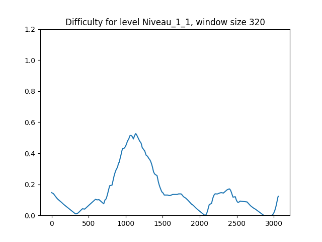

# GameChallengeTools-py
Python version of https://github.com/Iannyck/GameChallengeTools

This is a demo of the algorithm presented in the paper A Comprehensive Model of Automated Evaluation of Difficulty in Platformer Games. This project includes helper function to extrapolate information images and data from mario levels to then process into a difficulty curve. You can find an example implementation in python of the actual algorithm in gamedifficulty/Processing.py, function CalculateDifficulty

